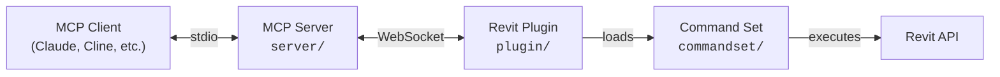

[](https://github.com/sparx-fire/mcp-servers-for-revit)

# mcp-servers-for-revit

**Connect AI assistants to Autodesk Revit via the Model Context Protocol.**

mcp-servers-for-revit enables AI clients like Claude, Cline, and other MCP-compatible tools to read, create, modify, and delete elements in Revit projects. It consists of three components: a TypeScript MCP server that exposes tools to AI, a C# Revit add-in that bridges commands into Revit, and a command set that implements the actual Revit API operations.

> [!NOTE]
> This is a fork of the original [mcp-servers-for-revit](https://github.com/mcp-servers-for-revit/revit-mcp) project with additional tools and functionality improvements.

## Architecture



The **MCP Server** (TypeScript) translates tool calls from AI clients into WebSocket messages. The **Revit Plugin** (C#) runs inside Revit, listens for those messages, and dispatches them to the **Command Set** (C#), which executes the actual Revit API operations and returns results back up the chain.

## Requirements

- **Node.js 18+** (for the MCP server)
- **Autodesk Revit 2020 - 2026** (any supported version)

## Quick Start (Using a Release)

1. Download the ZIP for your Revit version from the [Releases](https://github.com/sparx-fire/mcp-servers-for-revit/releases) page (e.g., `mcp-servers-for-revit-v1.0.0-Revit2025.zip`)

2. Extract the ZIP and copy the contents to your Revit addins folder:
   ```
   %AppData%\Autodesk\Revit\Addins\<your Revit version>\
   ```
   After copying you should have:
   ```
   Addins/2025/
   ├── mcp-servers-for-revit.addin
   └── revit_mcp_plugin/
       ├── revit-mcp-plugin.dll
       ├── ...
       └── Commands/
           └── RevitMCPCommandSet/
               ├── command.json
               └── 2025/
                   ├── RevitMCPCommandSet.dll
                   └── ...
   ```

3. Configure the MCP server in your AI client (see below)

4. Start Revit - the plugin loads automatically

## MCP Server Setup

The MCP server is published as an npm package and can be run directly with `npx`.

**Claude Code**

```bash
claude mcp add mcp-servers-for-revit -- npx -y @sparx-fire/mcp-servers-for-revit
```

**Claude Desktop**

Claude Desktop → Settings → Developer → Edit Config → `claude_desktop_config.json`:

```json
{
    "mcpServers": {
        "mcp-servers-for-revit": {
            "command": "npx",
            "args": ["-y", "@sparx-fire/mcp-servers-for-revit"]
        }
    }
}
```

Restart Claude Desktop. When you see the hammer icon, the MCP server is connected.


## Revit Plugin Setup

If using a release ZIP, the plugin is already included. For manual installation:

1. Build the plugin from `plugin/` (see [Development](#development))
2. Copy `mcp-servers-for-revit.addin` to `%AppData%\Autodesk\Revit\Addins\<version>\`
3. Copy the `revit_mcp_plugin/` folder to the same addins directory

## Command Set Setup

If using a release ZIP, the command set is pre-installed inside the plugin. For manual installation:

1. Build the command set from `commandset/` (see [Development](#development))
2. Inside the plugin's installation directory, create `Commands/RevitMCPCommandSet/<year>/`
3. Copy the built DLLs into that folder
4. Copy `command.json` (from repo root) into `Commands/RevitMCPCommandSet/`

## Supported Tools

| Tool | Description |
| ---- | ----------- |
| `get_current_view_info` | Get current active view info |
| `get_current_view_elements` | Get elements from the current active view |
| `get_available_family_types` | Get available family types in current project |
| `get_selected_elements` | Get currently selected elements |
| `get_material_quantities` | Calculate material quantities and takeoffs |
| `ai_element_filter` | Intelligent element querying tool for AI assistants |
| `analyze_model_statistics` | Analyze model complexity with element counts |
| `create_point_based_element` | Create point-based elements (door, window, furniture) |
| `create_line_based_element` | Create line-based elements (wall, beam, pipe) |
| `create_surface_based_element` | Create surface-based elements (floor, ceiling, roof) |
| `create_grid` | Create a grid system with smart spacing generation |
| `create_level` | Create levels at specified elevations |
| `create_room` | Create and place rooms at specified locations |
| `create_dimensions` | Create dimension annotations in the current view |
| `create_structural_framing_system` | Create a structural beam framing system |
| `delete_element` | Delete elements by ID |
| `operate_element` | Operate on elements (select, setColor, hide, etc.) |
| `color_elements` | Color elements based on a parameter value |
| `tag_all_walls` | Tag all walls in the current view |
| `tag_all_rooms` | Tag all rooms in the current view |
| `export_room_data` | Export all room data from the project |
| `store_project_data` | Store project metadata in local database |
| `store_room_data` | Store room metadata in local database |
| `query_stored_data` | Query stored project and room data |
| `send_code_to_revit` | Send C# code to Revit to execute |
| `say_hello` | Display a greeting dialog in Revit (connection test) |

## Testing

The test project uses [Nice3point.TUnit.Revit](https://github.com/Nice3point/RevitUnit) to run integration tests against a live Revit instance. No separate addin installation is required — the framework injects into the running Revit process automatically.

### Prerequisites

- **.NET 10 SDK** — required by Nice3point.Revit.Sdk 6.1.0. Install via `winget install Microsoft.DotNet.SDK.10`
- **Autodesk Revit 2026** (or 2025) — must be installed and licensed on your machine

### Running Tests

1. Open Revit 2026 (or 2025) and wait for it to fully load
2. Run the tests from the command line:

```bash
# For Revit 2026
dotnet test -c Debug.R26 -r win-x64 tests/commandset

# For Revit 2025
dotnet test -c Debug.R25 -r win-x64 tests/commandset
```

> **Note:** The `-r win-x64` flag is required on ARM64 machines because the Revit API assemblies are x64-only.

Alternatively, you can use `dotnet run`:

```bash
cd tests/commandset
dotnet run -c Debug.R26
```

### IDE Support

- **JetBrains Rider** — enable "Testing Platform support" in Settings > Build, Execution, Deployment > Unit Testing > Testing Platform
- **Visual Studio** — tests should be discoverable through the standard Test Explorer

### Test Structure

| Directory | Purpose |
|-----------|---------|
| `tests/commandset/AssemblyInfo.cs` | Global `[assembly: TestExecutor<RevitThreadExecutor>]` registration |
| `tests/commandset/Architecture/` | Tests for level and room creation commands |
| `tests/commandset/DataExtraction/` | Tests for model statistics, room data export, and material quantities |
| `tests/commandset/ColorSplashTests.cs` | Tests for color override functionality |
| `tests/commandset/TagRoomsTests.cs` | Tests for room tagging functionality |

### Writing New Tests

Test classes inherit from `RevitApiTest` and use TUnit's async assertion API:

```csharp
public class MyTests : RevitApiTest
{
    private static Document _doc;

    [Before(HookType.Class)]
    [HookExecutor<RevitThreadExecutor>]
    public static void Setup()
    {
        _doc = Application.NewProjectDocument(UnitSystem.Imperial);
    }

    [After(HookType.Class)]
    [HookExecutor<RevitThreadExecutor>]
    public static void Cleanup()
    {
        _doc?.Close(false);
    }

    [Test]
    public async Task MyTest_Condition_ExpectedResult()
    {
        var elements = new FilteredElementCollector(_doc)
            .WhereElementIsNotElementType()
            .ToElements();

        await Assert.That(elements.Count).IsGreaterThan(0);
    }
}
```

## Development

### MCP Server

```bash
cd server
npm install
npm run build
```

The server compiles TypeScript to `server/build/`. During development you can run it directly with `npx tsx server/src/index.ts`.

### Revit Plugin + Command Set

Open `mcp-servers-for-revit.sln` in Visual Studio. The solution contains both the plugin and command set projects. Build configurations target Revit 2020-2026:

- **Revit 2020-2024**: .NET Framework 4.8 (`Release R20` through `Release R24`)
- **Revit 2025-2026**: .NET 8 (`Release R25`, `Release R26`)

Building the solution automatically assembles the complete deployable layout in `plugin/bin/AddIn <year> <config>/` - the command set is copied into the plugin's `Commands/` folder as part of the build.

## Project Structure

```
mcp-servers-for-revit/
├── mcp-servers-for-revit.sln    # Combined solution (plugin + commandset + tests)
├── command.json     # Command set manifest
├── server/          # MCP server (TypeScript) - tools exposed to AI clients
├── plugin/          # Revit add-in (C#) - WebSocket bridge inside Revit
├── commandset/      # Command implementations (C#) - Revit API operations
├── tests/           # Integration tests (C#) - TUnit tests against live Revit
├── assets/          # Images for documentation
├── .github/         # CI/CD workflows, contributing guide, code of conduct
├── LICENSE
└── README.md
```

## Acknowledgements

This project is a fork of the work by the [mcp-servers-for-revit](https://github.com/mcp-servers-for-revit) team. The original repositories:

- [revit-mcp](https://github.com/mcp-servers-for-revit/revit-mcp) - MCP server
- [revit-mcp-plugin](https://github.com/mcp-servers-for-revit/revit-mcp-plugin) - Revit plugin
- [revit-mcp-commandset](https://github.com/mcp-servers-for-revit/revit-mcp-commandset) - Command set

Thank you to the original authors for creating the foundation that this project builds upon.

## License

[MIT](LICENSE)
